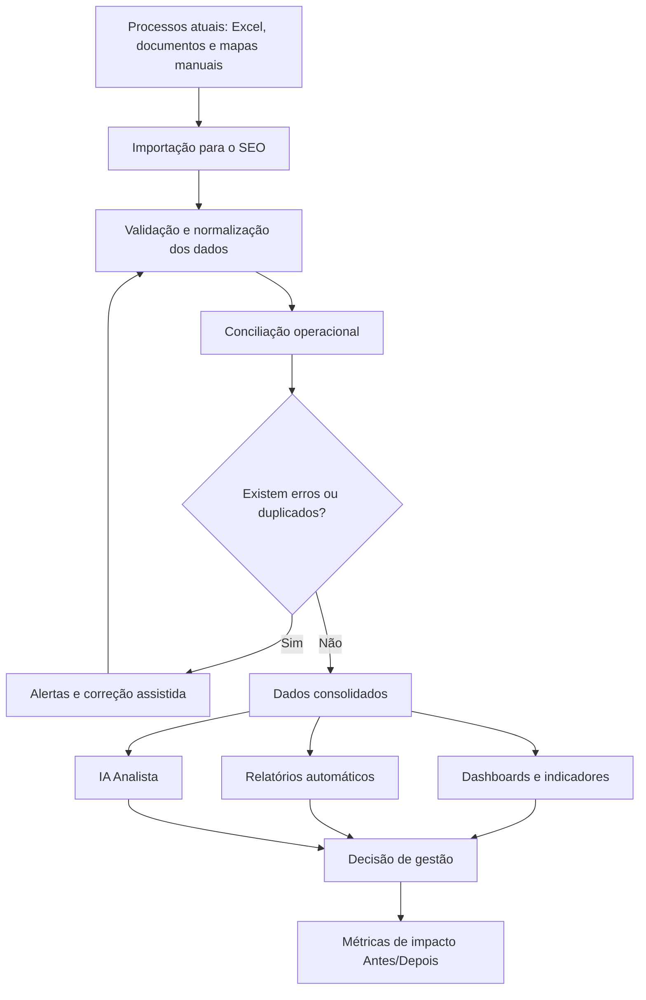

# SEO - Sistema de Eficiência Operacional

## Proposta de Projeto para Estágio Curricular em Economia

O **SEO - Sistema de Eficiência Operacional** é uma proposta de ferramenta digital de apoio à gestão, análise e automatização de processos numa empresa de comércio de peças automóveis.

O projeto surge no contexto de um estágio curricular em Economia, com o objetivo de transformar tarefas atualmente realizadas de forma manual, dispersa e dependente de Excel em processos mais organizados, rápidos e analíticos.

O sistema não pretende substituir imediatamente os métodos atuais da empresa. A sua implementação deve ocorrer de forma gradual, começando como uma ferramenta paralela de apoio à decisão, permitindo demonstrar resultados concretos antes de qualquer mudança estrutural.

## 1. Visão geral do projeto

O SEO pretende centralizar dados financeiros, comerciais e operacionais da empresa, permitindo analisar desempenho, controlar inventário, acompanhar clientes e fornecedores, reconciliar movimentos e gerar relatórios automáticos.

Objetivos principais:

- Reduzir trabalho manual.
- Diminuir erros.
- Acelerar análises mensais.
- Melhorar o controlo de inventário.
- Acompanhar clientes e fornecedores.
- Analisar vendas por plataforma.
- Gerar relatórios automáticos.
- Apoiar decisões de gestão.

O projeto deve ser apresentado como uma iniciativa de transformação digital aplicada, com valor económico e operacional mensurável. A sua força não está apenas na tecnologia, mas na capacidade de ligar dados dispersos a decisões concretas.

## 2. Arquitetura do sistema

A arquitetura proposta divide o SEO em quatro camadas.

### Interface web

Camada utilizada pelos colaboradores e pela administração. Deve apresentar dashboards, tabelas, formulários, filtros, alertas e relatórios de forma simples, profissional e responsiva.

Tecnologias sugeridas:

- React.
- TypeScript.
- TailwindCSS.
- Recharts.

### API e lógica de negócio

Camada responsável por regras de negócio, validações, cálculos, conciliações, classificações, indicadores e comunicação com a base de dados.

Tecnologias sugeridas:

- FastAPI.
- Python.
- Pandas.
- NumPy.

### Base de dados

Camada responsável por guardar informação operacional, financeira e comercial.

Tecnologia sugerida:

- PostgreSQL.

### Motor analítico e IA

Camada responsável por análise automática, deteção de inconsistências, sugestões, ranking de desempenho e respostas em linguagem natural.

Tecnologia sugerida:

- OpenAI API ou modelo equivalente.

## 3. Estrutura da base de dados

A base de dados deve ser modular, permitindo começar por um conjunto reduzido de tabelas e evoluir para um ERP mais completo.

Tabelas principais propostas:

| Tabela | Finalidade |
| --- | --- |
| `users` | Utilizadores, perfis e permissões |
| `customers` | Clientes e dados comerciais |
| `suppliers` | Fornecedores e condições comerciais |
| `products` | Peças, referências, categorias e estado |
| `inventory_movements` | Entradas, saídas e ajustes de stock |
| `sales` | Vendas por canal |
| `sale_items` | Linhas de venda por produto |
| `purchases` | Compras a fornecedores |
| `expenses` | Despesas operacionais |
| `documents` | Faturas, recibos, notas de crédito e documentos importados |
| `cash_movements` | Mapa de caixa e movimentos financeiros |
| `kilometer_logs` | Mapa de quilómetros e deslocações |
| `marketplace_fees` | Comissões e custos por plataforma |
| `reconciliation_runs` | Processos de conciliação executados |
| `reconciliation_issues` | Erros, duplicados e inconsistências |
| `monthly_reports` | Relatórios mensais gerados |
| `impact_metrics` | Métricas de impacto Antes/Depois |

Campos essenciais por área:

- Produtos: referência, nome, categoria, marca, estado, custo, preço de venda, localização, stock atual e stock mínimo.
- Vendas: data, cliente, canal, valor bruto, desconto, comissão, custo, margem e estado de pagamento.
- Documentos: tipo, número, entidade, data, vencimento, valor, estado e ficheiro de origem.
- Contas correntes: entidade, documento, valor em aberto, data de vencimento e dias em atraso.
- Impacto: módulo, processo analisado, tempo antes, tempo depois, erros detetados, automatizações e observações.

## 4. Módulos e funcionalidades

### Dashboard Executivo

Funcionalidades:

- Vendas do dia e do mês.
- Lucro estimado.
- Margem média.
- Stock total.
- Produtos parados.
- Clientes em dívida.
- Fornecedores por pagar.
- Documentos vencidos.
- Top produtos vendidos.
- Comparação por plataforma.

Métrica de impacto:

- Tempo poupado na preparação da visão diária e mensal da empresa.

### Conciliação Operacional

Funcionalidades:

- Importação de Excel, CSV e PDF.
- Verificação automática de movimentos.
- Deteção de duplicados.
- Identificação de inconsistências.
- Sugestão de classificação contabilística.
- Alertas de erro.

Métrica de impacto:

- Erros, duplicados e inconsistências identificados automaticamente.

### Análise Financeira

Funcionalidades:

- Receitas.
- Custos.
- Despesas.
- Resultado mensal.
- Margem bruta.
- Margem líquida.
- EBITDA.
- Ponto de equilíbrio.
- Rentabilidade por produto, cliente e plataforma.

Métrica de impacto:

- Tempo poupado na criação de relatórios financeiros mensais.

### Análise de Marketplaces

Funcionalidades:

- Ovoko.
- Recambio.
- Loja online.
- Receita por plataforma.
- Comissões.
- Custos associados.
- Margem real.
- Produtos mais vendidos.
- Produtos menos rentáveis.
- Ranking automático de desempenho.

Métrica de impacto:

- Melhoria na visibilidade da margem real por plataforma.

### Contas Correntes

Funcionalidades:

- Clientes em dívida.
- Fornecedores por pagar.
- Antiguidade dos saldos.
- Faturas vencidas.
- Vencimentos próximos.
- Histórico de pagamentos.
- Alertas automáticos.

Métrica de impacto:

- Faturas vencidas e saldos em atraso identificados sem verificação manual.

### Inventário Inteligente

Funcionalidades:

- Entradas.
- Saídas.
- Stock atual.
- Stock mínimo.
- Rotação de produtos.
- Produtos sem movimento.
- Produtos críticos.
- Produtos com alta procura.
- Previsão de reposição.

Métrica de impacto:

- Produtos parados, críticos ou com necessidade de reposição identificados automaticamente.

### Business Intelligence

Funcionalidades:

- Ticket médio.
- Taxa de conversão.
- Margem média.
- Evolução mensal.
- Comparação entre canais de venda.
- Rentabilidade por fornecedor.
- Indicadores de eficiência operacional.

Métrica de impacto:

- Indicadores de gestão consolidados sem cruzamento manual de ficheiros.

### IA Analista

Funcionalidades:

- Responder a perguntas sobre lucro, margem, dívidas, stock e despesas.
- Identificar erros ou inconsistências nos mapas.
- Sugerir prioridades operacionais.
- Gerar explicações simples sobre resultados mensais.

Métrica de impacto:

- Perguntas de gestão respondidas automaticamente a partir dos dados consolidados.

## 5. Wireframes dos principais ecrãs

### Dashboard Executivo

```text
+------------------------------------------------------------------+
| SEO | Dashboard | Inventário | Marketplaces | Financeiro | IA     |
+------------------------------------------------------------------+
| Período: Junho 2026       Canal: Todos        Exportar relatório  |
+----------------+----------------+----------------+----------------+
| Vendas do mês  | Lucro estimado | Margem média   | Stock total    |
| 42.350 EUR     | 8.920 EUR      | 21,1%          | 3.842 peças    |
+----------------+----------------+----------------+----------------+
| Alertas                                                         |
| - 18 produtos parados há mais de 90 dias                        |
| - 7 clientes com faturas vencidas                               |
| - 3 documentos com inconsistências                              |
+----------------------------------+-------------------------------+
| Vendas por plataforma            | Top produtos vendidos         |
| [Gráfico de barras]              | [Tabela de ranking]           |
+----------------------------------+-------------------------------+
| Impacto do SEO                                                   |
| Antes: relatório mensal manual 2 h | Depois: automático 10 min    |
+------------------------------------------------------------------+
```

### Conciliação Operacional

```text
+------------------------------------------------------------------+
| Conciliação Operacional                                          |
+------------------------------------------------------------------+
| Importar ficheiro: [Excel/CSV/PDF] [Selecionar] [Validar dados]   |
+------------------------------------------------------------------+
| Resumo da validação                                               |
| Movimentos lidos: 1.248 | Duplicados: 14 | Inconsistências: 9    |
+------------------------------------------------------------------+
| Tabela de problemas                                               |
| Data | Documento | Valor | Problema | Sugestão | Estado          |
+------------------------------------------------------------------+
| Impacto: 23 erros identificados antes de integrar os dados        |
+------------------------------------------------------------------+
```

### Inventário Inteligente

```text
+------------------------------------------------------------------+
| Inventário Inteligente                                           |
+------------------------------------------------------------------+
| Procurar referência... | Categoria | Estado | Localização         |
+------------------------------------------------------------------+
| KPI: Stock total | Produtos parados | Stock crítico | Alta procura |
+------------------------------------------------------------------+
| Referência | Produto | Stock | Última venda | Margem | Alerta      |
+------------------------------------------------------------------+
| Impacto: 18 produtos parados identificados automaticamente        |
+------------------------------------------------------------------+
```

### IA Analista

```text
+------------------------------------------------------------------+
| IA Analista                                                       |
+------------------------------------------------------------------+
| Pergunte sobre vendas, lucro, stock, dívidas ou inconsistências   |
| [Qual plataforma gerou maior margem este mês?                 ]   |
| [Perguntar]                                                       |
+------------------------------------------------------------------+
| Resposta                                                          |
| A plataforma com maior margem real foi a loja online, com 24,8%.  |
| A Ovoko teve maior volume, mas menor margem após comissões.       |
+------------------------------------------------------------------+
| Ações sugeridas                                                   |
| - Rever preços de produtos com baixa margem na Ovoko              |
| - Priorizar reposição das referências com maior procura           |
+------------------------------------------------------------------+
```

## 6. Fluxograma operacional



## 7. Roadmap de implementação

### Fase 1 - Diagnóstico operacional

- Levantar mapas existentes.
- Identificar fontes de dados.
- Mapear processos manuais.
- Medir tempos atuais.
- Identificar erros frequentes.

### Fase 2 - MVP analítico

- Criar importação de Excel/CSV.
- Criar dashboard mensal.
- Criar análise por plataforma.
- Criar listagem de clientes em dívida.
- Criar listagem de fornecedores por pagar.
- Criar relatório mensal automático.

### Fase 3 - Conciliação e alertas

- Detetar duplicados.
- Identificar documentos vencidos.
- Validar movimentos divergentes.
- Criar alertas de inconsistências.
- Registar métricas de impacto.

### Fase 4 - Inventário e rentabilidade

- Controlar stock.
- Identificar produtos parados.
- Calcular rotação.
- Medir margem por produto.
- Comparar rentabilidade por canal.

### Fase 5 - IA Analista

- Permitir perguntas em linguagem natural.
- Gerar explicações de resultados.
- Sugerir prioridades operacionais.
- Apoiar a preparação de reuniões mensais.

### Fase 6 - Evolução para ERP

- Integrar processos comerciais, financeiros, logísticos e administrativos.
- Criar permissões por utilizador.
- Automatizar fluxos recorrentes.
- Integrar com sistemas externos quando necessário.

## 8. MVP inicial realista

O MVP deve ser simples, funcional e demonstrável num curto período.

Funcionalidades do MVP:

- Importação de ficheiros Excel/CSV.
- Dashboard com vendas, margens e resultado mensal.
- Análise por plataforma: loja online, Ovoko e Recambio.
- Lista de clientes em dívida.
- Lista de fornecedores por pagar.
- Identificação de produtos parados.
- Relatório mensal automático.
- Quadro Antes/Depois com tempo poupado e erros identificados.

O MVP pode começar como uma aplicação web simples ou uma versão analítica com Python, antes de evoluir para a arquitetura completa React + FastAPI + PostgreSQL.

## 9. Plano de evolução para ERP completo

O SEO pode evoluir para um ERP interno por etapas.

Etapas de evolução:

1. Sistema analítico paralelo.
2. Dashboard e relatórios automáticos.
3. Registo estruturado de vendas, compras e inventário.
4. Contas correntes de clientes e fornecedores.
5. Gestão documental.
6. Controlo de stock e localizações.
7. Automação de processos recorrentes.
8. Integração com marketplaces.
9. Integração contabilística.
10. ERP operacional completo.

Esta evolução deve ser orientada por valor demonstrado, não por substituição imediata.

## 10. Estratégia de implementação gradual sem resistência da equipa

A estratégia ideal é reduzir resistência através da utilidade prática.

Passos recomendados:

1. Observar primeiro como a equipa trabalha.
2. Executar os processos atuais para compreender dificuldades reais.
3. Criar ferramentas internas para uso próprio durante o estágio.
4. Automatizar pequenas tarefas repetitivas.
5. Comparar tempo antes e depois.
6. Mostrar resultados concretos sem impor mudanças.
7. Recolher feedback da equipa.
8. Ajustar a ferramenta aos fluxos reais.
9. Propor adoção gradual apenas depois de demonstrar benefício.

Mensagem-chave:

> O SEO não vem substituir a forma atual de trabalhar. Vem apoiar, organizar e reduzir trabalho repetitivo. A mudança só deve acontecer quando a equipa reconhecer valor prático.

## 11. Como apresentar o projeto à administração

A apresentação deve ser objetiva, orientada a resultados e livre de excesso técnico.

Estrutura recomendada:

1. Problema atual: dados dispersos, tempo manual, risco de erro.
2. Proposta: ferramenta paralela de apoio à análise.
3. Demonstração: dashboard, conciliação, inventário e relatório mensal.
4. Impacto: tempo poupado, erros detetados, decisões mais rápidas.
5. Baixo risco: não substitui processos atuais de imediato.
6. Próximo passo: testar MVP com dados reais.

Discurso sugerido:

> Durante o estágio, identifiquei processos repetitivos que podem ser apoiados por uma ferramenta simples de análise. A proposta inicial não é substituir o método atual, mas criar uma solução paralela que ajude a reduzir tempo, organizar informação e melhorar a leitura dos resultados.

## 12. Como transformar este projeto em relatório de estágio em Economia

O projeto pode ser enquadrado como uma aplicação prática de Economia, gestão e análise de dados numa empresa real.

Título académico possível:

**Desenvolvimento de uma ferramenta de apoio à eficiência operacional e análise económica aplicada no setor de comércio de peças automóveis.**

Capítulos recomendados:

1. Introdução e enquadramento do estágio.
2. Caracterização da empresa e dos processos atuais.
3. Diagnóstico dos problemas operacionais.
4. Fundamentação económica: eficiência, custos de transação, produtividade e informação para decisão.
5. Metodologia de recolha e tratamento de dados.
6. Desenvolvimento conceptual do SEO.
7. Indicadores financeiros e operacionais.
8. Resultados esperados e métricas Antes/Depois.
9. Limites do projeto.
10. Propostas de evolução.
11. Conclusão.

Ligação direta às tarefas do estágio:

| Tarefa do estágio | Aplicação no SEO |
| --- | --- |
| Mapas de caixa, mapas de quilómetros e mapas diários | Dashboard Executivo e relatórios operacionais |
| Conciliação de movimentos | Módulo de conciliação financeira |
| Análise de resultados mensais | Dashboard executivo |
| Análise Ovoko, Recambio e loja online | Módulo de marketplaces |
| Contas correntes de clientes e fornecedores | Módulo de contas correntes |
| Inventário | Módulo de inventário inteligente |

## 13. Como demonstrar valor através de dados Antes/Depois

O SEO deve incluir uma área de impacto que compare os processos antes e depois da utilização do sistema.

Comparação principal:

| Processo | Antes | Depois | Impacto medido |
| --- | --- | --- | --- |
| Relatório mensal | 2 horas | 10 minutos | 1 h 50 min poupados |
| Conferência de movimentos | Manual | Automática | Erros detetados antes do fecho |
| Análise de marketplaces | Dispersa | Centralizada | Margem real por plataforma |
| Inventário | Consulta manual | Indicadores automáticos | Produtos parados identificados |
| Contas correntes | Exportação manual | Alertas por vencimento | Faturas vencidas visíveis |

Métricas a acompanhar:

- Tempo médio por tarefa antes e depois.
- Número de erros identificados.
- Número de duplicados detetados.
- Quantidade de documentos conciliados.
- Número de relatórios gerados automaticamente.
- Valor em dívida identificado.
- Produtos parados sinalizados.
- Margem por plataforma antes invisível.

Forma de demonstração:

1. Escolher um processo real.
2. Medir o tempo manual atual.
3. Executar o mesmo processo no SEO.
4. Comparar tempo, erros e clareza da informação.
5. Apresentar resultado em tabela simples.
6. Repetir em vários módulos.

## Conclusão

O SEO tem potencial para transformar uma atividade prática de estágio num projeto real de melhoria empresarial, juntando Economia, análise de dados, gestão operacional e transformação digital.

A melhor estratégia é começar pequeno, mostrar utilidade prática e deixar que a própria empresa perceba o valor antes de propor uma adoção mais ampla.

O diferencial do projeto está em demonstrar eficiência operacional com dados concretos: menos tempo, menos erros, melhor organização e melhor decisão.
